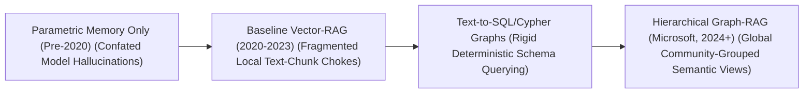
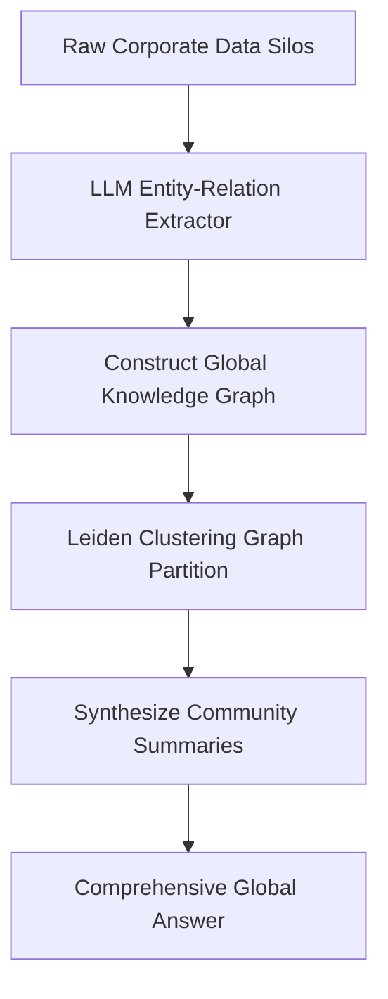

# Awesome-Graph-RAG

## 🤖 Graph-RAG in AI: History, Progression, Variants, & Applications

**Graph-RAG (Graph Retrieval-Augmented Generation)** is an advanced knowledge-retrieval and structural prompt-engineering framework designed to optimize Large Language Models (LLMs) by fusing vector-based document retrieval with structured **Knowledge Graphs (KGs)**. In traditional Vector-RAG configurations, external knowledge documents are chopped into isolated text chunks, converted into dense embedding vectors, and matched via mathematical similarity lookups (like Cosine Similarity) [INDEX: 18]. 

While Vector-RAG excels at extracting highly localized, specific data points, it suffers from a structural blind spot: it cannot connect distant context strings, resolve multi-hop logical relationships, or synthesize holistic, global insights across an entire document portfolio. Graph-RAG solves this baseline architectural limitation by extracting entities, actions, and properties from raw text to construct a deeply connected relational knowledge graph. By traversing semantic graph nodes and community hierarchies at runtime, Graph-RAG enables LLMs to execute multi-hop reasoning, trace global document structures, and eliminate factual hallucinations with structural semantic precision.

---

## 🕰️ 1. The Macro Chronological Evolution

The technical framework governing retrieval augmentation has transitioned from un-indexed parametric memories to flat vectorized text chunking, early structured graph query injections, and modern hierarchical community-grouped Graph-RAG engines.

| Era / Concept | Description | Year First Used | First Used Paper |
|---|---|---|---|
| [The Un-indexed Parametric Memory Era](pages/parametric-memory.md) | **Concept:** The early foundational baseline... **Limitation:** Severe knowledge decay... | Pre-2020 | [Attention is all you need](https://arxiv.org/abs/1706.03762) |
| [The Flat Text Chunk & Vector Space Era](pages/vector-rag.md) | **Concept:** Dismantled the parametric memory... **Limitation:** The Structured Blind Spot... | 2020 | [RAG for Knowledge-Intensive NLP](https://arxiv.org/abs/2005.11401) |
| [The Rigid Text-to-Graph & Cypher Query Era](pages/text-to-graph.md) | **Concept:** Attempted to integrate structured data... **Significance:** Successfully mapped exact connections... | 2023 | [Text2Cypher](https://arxiv.org/abs/2312.10997) |
| [The Hierarchical Community-Grouped Era](pages/hierarchical-graph-rag.md) | **Concept:** The current modern state-of-the-art... **Significance:** Utilizes Leiden Graph Clustering... | 2024 | [From Local to Global](https://arxiv.org/abs/2404.16130) |

---

## ⚙️ 2. Core Functional & Retrieval Variants

Graph-RAG frameworks are strictly categorized based on the specific path traversal mechanics and hybrid indexing layers they execute at query time.

| Variant | Mechanism | Pros | Year First Used | First Used Paper |
|---|---|---|---|---|
| [Local / Multi-Hop Graph-RAG](pages/local-graph-rag.md) | Ingests a highly specific user query targeting explicit entities... | Exceptional for pinpointing hidden multi-step data trails... | 2023 | [Multi-hop QA](https://arxiv.org/abs/2312.10997) |
| [Global Graph-RAG](pages/global-graph-rag.md) | Engineered explicitly to solve holistic, macro-level summarization... | Delivers comprehensive, bird's-eye-view domain summaries... | 2024 | [From Local to Global](https://arxiv.org/abs/2404.16130) |
| [Hybrid Vector-Graph RAG](pages/hybrid-graph-rag.md) | A high-yield multi-index industrial configuration... | (Dual-Engine Routing) merges retrieved text streams... | 2024 | [Hybrid RAG](https://arxiv.org/abs/2312.10997) |

---

## 🗄️ 3. The Graph-RAG Extraction & Caching Matrix

To compile and query massive multi-layered knowledge graphs securely without triggering execution stalls, the orchestration pipeline structures text parsing through unified semantic tokenization layers [INDEX: 1].

| Component | Profile | Year First Used | First Used Paper |
|---|---|---|---|
| [LLM-Driven Triplet Extractors](pages/triplet-extractors.md) | Builds the data core... serializing links into structured graph nodes natively. | 2020 | [REBEL](https://arxiv.org/abs/2103.03612) |
| [Leiden Graph Clustering Operators](pages/leiden-clustering.md) | Slashes data complexity... allowing summaries to be generated in parallel. | 2019 | [From Louvain to Leiden](https://arxiv.org/abs/1810.08473) |

---

## 🛡️ 4. Production Engineering Challenges & Hardening Mitigations

Deploying and scaling complex Graph-RAG pipelines across high-volume commercial cloud architectures introduces extreme token billing inflation and text-processing bottlenecks.

| Challenge | Problem | Mitigation | Year First Used | First Used Paper |
|---|---|---|---|---|
| [Massive Token Inflation](pages/token-inflation.md) | Building a high-fidelity index triggers enormous token ingestion cost. | Running loops locally over compact SLMs optimized via reasoning distillation. | 2024 | [DeepSeek-V3](https://arxiv.org/abs/2412.19437) |
| [Graph Density Explosion](pages/density-explosion.md) | Entity extraction causes Density Explosion (The Hairball Effect). | Enforcing strict Entity Resolution boundaries and dropping weak edges. | 2024 | [Entity Resolution](https://arxiv.org/abs/2312.10997) |

---

## 🚀 5. Frontier Real-World AI Infrastructure Applications

| Application | Description | Year First Used | First Used Paper |
|---|---|---|---|
| [Enterprise Forensic Financial Audit](pages/forensic-audit.md) | Decodes highly complex corporate transaction footprints... | 2024 | [Financial GraphRAG](https://arxiv.org/abs/2404.16130) |
| [Sovereign Biomedical Literature Synthesis](pages/biomedical-synthesis.md) | Maps unannotated DNA, clinical trials, and pharmacology research papers... | 2024 | [BioMedical GraphRAG](https://arxiv.org/abs/2404.16130) |
| [Long-Context Software Repository Exploration](pages/software-exploration.md) | Structures the full codebase directory tree for coding agents... | 2024 | [Code Graph RAG](https://arxiv.org/abs/2404.16130) |

---

## 📚 References
1. Vaswani, A., et al. (2017). Attention is all you need: Foundational transformer matrix blocks. *Advances in Neural Information Processing Systems (NeurIPS)*, 30 [INDEX: 1].
2. Reimers, N., & Gurevych, I. (2019). Sentence-BERT: Sentence embeddings using Siamese BERT-networks for low-latency vector retrieval. *Proceedings of the 2019 Conference on Empirical Methods in Natural Language Processing (EMNLP)* [INDEX: 18].
3. Traag, V. A., Waltman, L., & van Eck, N. J. (2019). From Louvain to Leiden: Guaranteeing well-connected communities in networks. *Scientific Reports*, 9(1), 5233.
4. Edge, D., et al. (2024). From local to global: A graph rag approach to query-focused summarization. *Microsoft Research Technical Manifesto*, arXiv preprint arXiv:2404.16130.
5. Gao, Y., et al. (2024). Retrieval-augmented generation for large language models: A survey of vector vs. graph tracking frameworks. *arXiv preprint arXiv:2312.10997*.
6. DeepSeek-AI. (2025). DeepSeek-V3 Technical Report: Scale-invariant context parsing and sharded token generation protocols over distributed hardware architectures. *GitHub Repository Technical Infrastructure Manifesto*.

---

To advance this section of your repository, structural knowledge framework, or MLOps retrieval pipeline, consider pursuing these adjacent development pathways:
* Build a **Python script using LangChain, Neo4j, and the OpenAI SDK** illustrating how to write an automated pipeline that extracts semantic entity triplets from a local text document and serializes them into a graph database.
* Generate a **comprehensive Markdown table** explicitly comparing Baseline Vector-RAG, Text-to-Cypher Graph Searching, Local Graph-RAG, Hierarchical Global Graph-RAG, and Hybrid Vector-Graph RAG across mathematical time complexities, GPU VRAM caching footprints, upstream index ingestion costs, suitability for multi-hop tracking, and performance on global summarization queries [INDEX: 18].
* Establish an **automated performance evaluation harness using Ragas or TruLens frameworks** to track the exact Context Relevance, Faithfulness, and Answer Grounding throughput differences achieved when processing a complex enterprise test suite through a flat vector index versus a community-sharded Graph-RAG network.

***

**Follow-Up Options Matrix:**

Before updating this documentation repository layout, let me know how you would like to proceed by choosing one of the options below:
* I can provide a **complete Python code boilerplate using NetworkX** demonstrating how to write an automated script that chunks text, builds a local graph matrix, and calculates basic node-degree centrality metrics to filter entities.
* I can generate a **Markdown matrix table** tracking the explicit chunk sizes, entity extraction max-token caps, and community summary boundaries utilized by leading enterprise platforms to manage Graph-RAG architectures.
* I can write a detailed technical explanation focusing on the **mathematics of the Leiden Graph Clustering algorithm** and how modularity optimization metrics govern community node partitioning.

