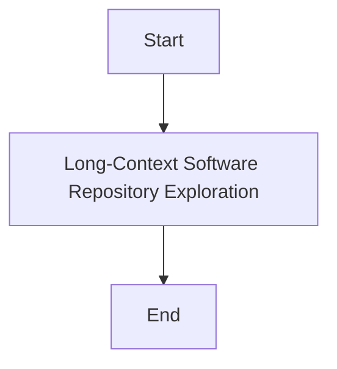

# Long-Context Software Repository Exploration

Detailed information about Long-Context Software Repository Exploration.

```mermaid
graph TD;
    A[Start] --> B[Long-Context Software Repository Exploration];
    B --> C[End];
```
